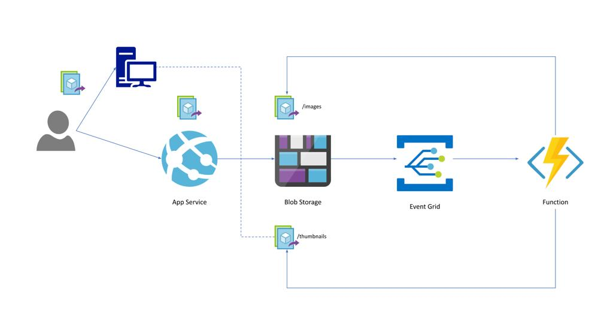

## Design

## Requirements

| Name | Version |
|------|---------|
|  [azurerm](#requirement\_azurerm) | >=3.0.1 |

## Providers

| Name | Version |
|------|---------|
|  [azurerm](#provider\_azurerm) | >=3.0.1 |
|  [null](#provider\_null) | n/a |

## Modules

No modules.

## Resources

| Name | Type |
|------|------|
| [azurerm_app_service_source_control.example](https://registry.terraform.io/providers/hashicorp/azurerm/latest/docs/resources/app_service_source_control) | resource |
| [azurerm_eventgrid_event_subscription.subscription](https://registry.terraform.io/providers/hashicorp/azurerm/latest/docs/resources/eventgrid_event_subscription) | resource |
| [azurerm_function_app_function.function](https://registry.terraform.io/providers/hashicorp/azurerm/latest/docs/resources/function_app_function) | resource |
| [azurerm_resource_group.rg](https://registry.terraform.io/providers/hashicorp/azurerm/latest/docs/resources/resource_group) | resource |
| [azurerm_service_plan.asp](https://registry.terraform.io/providers/hashicorp/azurerm/latest/docs/resources/service_plan) | resource |
| [azurerm_storage_account.blobstorage](https://registry.terraform.io/providers/hashicorp/azurerm/latest/docs/resources/storage_account) | resource |
| [azurerm_storage_account.functionstorage](https://registry.terraform.io/providers/hashicorp/azurerm/latest/docs/resources/storage_account) | resource |
| [azurerm_storage_container.images_container](https://registry.terraform.io/providers/hashicorp/azurerm/latest/docs/resources/storage_container) | resource |
| [azurerm_storage_container.thumbnail_container](https://registry.terraform.io/providers/hashicorp/azurerm/latest/docs/resources/storage_container) | resource |
| [azurerm_windows_function_app.functionapp](https://registry.terraform.io/providers/hashicorp/azurerm/latest/docs/resources/windows_function_app) | resource |
| [azurerm_windows_web_app.webapp](https://registry.terraform.io/providers/hashicorp/azurerm/latest/docs/resources/windows_web_app) | resource |
| [null_resource.functionapp_deployment](https://registry.terraform.io/providers/hashicorp/null/latest/docs/resources/resource) | resource |

## Inputs

| Name | Description | Type | Default | Required |
|------|-------------|------|---------|:--------:|
|  [asp\_name](#input\_asp\_name) | n/a | `string` | n/a | yes |
|  [blob\_account\_replication\_type](#input\_blob\_account\_replication\_type) | n/a | `string` | `""` | no |
|  [blob\_storage\_account\_tier](#input\_blob\_storage\_account\_tier) | n/a | `string` | `""` | no |
|  [company](#input\_company) | n/a | `string` | `""` | no |
|  [env](#input\_env) | n/a | `string` | `""` | no |
|  [event\_delivery\_schema](#input\_event\_delivery\_schema) | n/a | `string` | `""` | no |
|  [function\_account\_replication\_type](#input\_function\_account\_replication\_type) | n/a | `string` | `""` | no |
|  [function\_app\_function](#input\_function\_app\_function) | n/a | `string` | `""` | no |
|  [function\_app\_name](#input\_function\_app\_name) | n/a | `string` | `""` | no |
|  [function\_storage\_account\_tier](#input\_function\_storage\_account\_tier) | n/a | `string` | `""` | no |
|  [image\_resizer\_eventsub](#input\_image\_resizer\_eventsub) | n/a | `string` | `""` | no |
|  [image\_resizer\_webapp](#input\_image\_resizer\_webapp) | n/a | `string` | n/a | yes |
|  [images\_container\_access\_type](#input\_images\_container\_access\_type) | n/a | `string` | n/a | yes |
|  [images\_container\_name](#input\_images\_container\_name) | Storage Container name in Azure | `string` | n/a | yes |
|  [language](#input\_language) | n/a | `string` | `""` | no |
|  [location](#input\_location) | RG location in Azure | `string` | n/a | yes |
|  [os\_type](#input\_os\_type) | n/a | `string` | n/a | yes |
|  [resource\_group\_name](#input\_resource\_group\_name) | RG name in Azure | `string` | n/a | yes |
|  [sku\_name](#input\_sku\_name) | n/a | `string` | n/a | yes |
|  [storage\_account\_name](#input\_storage\_account\_name) | Storage Account name in Azure | `string` | n/a | yes |
|  [storage\_account\_name\_function](#input\_storage\_account\_name\_function) | function Storage Account name in Azure | `string` | n/a | yes |
|  [thumbnail\_container\_access\_type](#input\_thumbnail\_container\_access\_type) | n/a | `string` | n/a | yes |
|  [thumbnail\_container\_name](#input\_thumbnail\_container\_name) | Storage Container name in Azure | `string` | n/a | yes |
|  [webapp\_repo\_branch](#input\_webapp\_repo\_branch) | n/a | `string` | n/a | yes |
|  [webapp\_repo\_url](#input\_webapp\_repo\_url) | n/a | `string` | n/a | yes |

## Outputs

No outputs.
